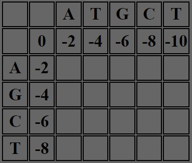

# Global DNA Sequence Alignment
> Global DNA Sequence Alignment using Needleman-Wunsch Algorithm

## How To Run
1. Download or Clone this repository
2. Open the `index.html` file on a <em><strong>Chromium Based</strong></em> Website

## What is Needleman-Wunsch Algorithm

### Definition
Needleman-Wunsch Algorithm is an algorithm which is used to align DNA, RNA, or protein sequences. This algorithm is used widely to solve the global alignment problem. It has a worst-case performance and space complexity of `O(mn)`.

### How to Construct The Grid

<table>
<tr>
    <td width="170" height="170">
        
    </td>
    <td>
        

        The way that I choose to construct the grid is by making a matrix. This matrix has a size of m+2 times n+2. For example we have the first sequence ATGCT and the second sequence AGCT. We will then create a matrix of first sequence length + 2 which is 7 times second sequence length + 2 which is 6. After forming the 7x6 matrix, we will fill the top left matrix, its bottom and its right blank. Then we will fill the matrix with the sequence. After the sequence filling, the matrix then will look like the image on the left.
        

    </td>
</tr>
<tr>
    <td width="170" height="170">
        
    </td>
    <td>
        

        After making the base structure, the next thing that I do is to fill the leftmost and topmost cells with numbers which are its position times the gap value. In this case, the gap value that i choose is -2. Thus, the border value will be the multiple of -2 (0, -2, -4, -6, -8, ...). After the left and top border filling, the matrix will then look the image on the left.
        

    </td>
</tr>
<tr>
    <td width="170" height="170">
        
    </td>
    <td>
        

        After filling the leftmost and topmost cells. The next step is to fill the rest of the table. To fill the rest of the table, i use the Needleman-Wunsch scoring formula. Which look like this 
         
        The s(xi,yi) value will be +1 (match) or -1 (mismatch)
        

    </td>
</tr>
<tr>
    <td width="170" height="170">
        
    </td>
    <td>
        

        After filling all of the cells. The last step is to show the traceback by coloring. To start the coloring, first we will start by coloring the bottom right corner of the matrix. Then check whether or not the topmost column of the cell and the leftmost row of the cell are a match or not. If they're a match, color the left diagonal. If they're not a match, color the tile that has the highest score from the left, left diagonal, and up neighbour.
        

    </td>
</tr>

</table>

## Reference, Framework, and Library

### Reference :  
https://www.youtube.com/watch?v=ipp-pNRIp4g

### Framework & Library :  
None